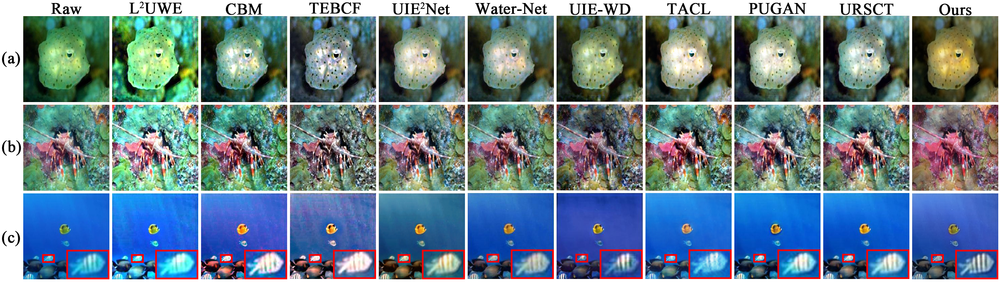
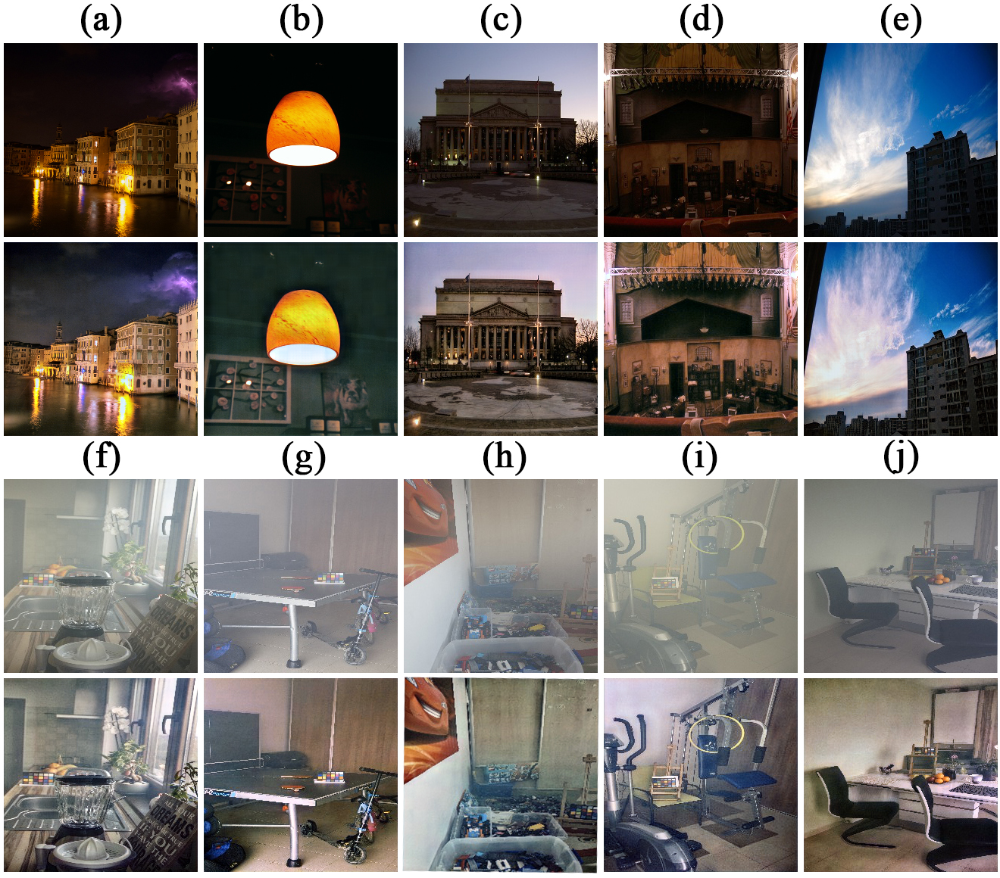

# CTM
This is the project of Underwater image enhancement via cross-wise transformer network focusing on pre-post differences.

# Abstract 
The images captured underwater often suffer from color deviations and blurred details. To address these issues, many methods employ networks with an encoder/decoder structure to enhance the images. However, the direct skip connection overlooks the differences between pre- and post-features, and deep network learning introduces information loss. This paper presents an underwater image enhancement network that focuses on pre-post differences. The network utilizes a multi-scale input and output framework to facilitate the underwater image enhancement process. A novel cross-wise transformer module (CTM) is introduced to guide the interactive learning of features from different periods, thereby enhancing the emphasis on detail-degraded regions. To compensate for the information loss within the deep network, a feature supplement module (FSM) is devised for each learning stage. FSM merges the multi-scale input features, effectively enhancing the visibility of underwater images. Experimental results across several datasets demonstrate that the integrated modules yield significant enhancements in network performance. The proposed network exhibits outstanding performance in both visual comparisons and quantitative metrics. Furthermore, the network also exhibits good adaptability in additional visual tasks without the need for parameter tuning.

Here are some comparison graphs of our method:

The complete codes and models will be made public soon
